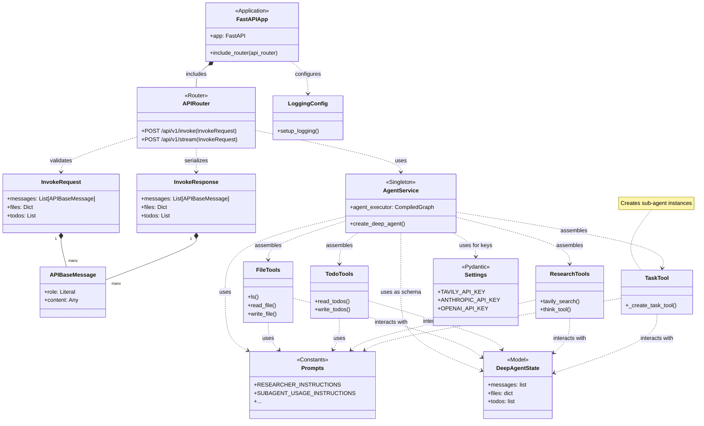
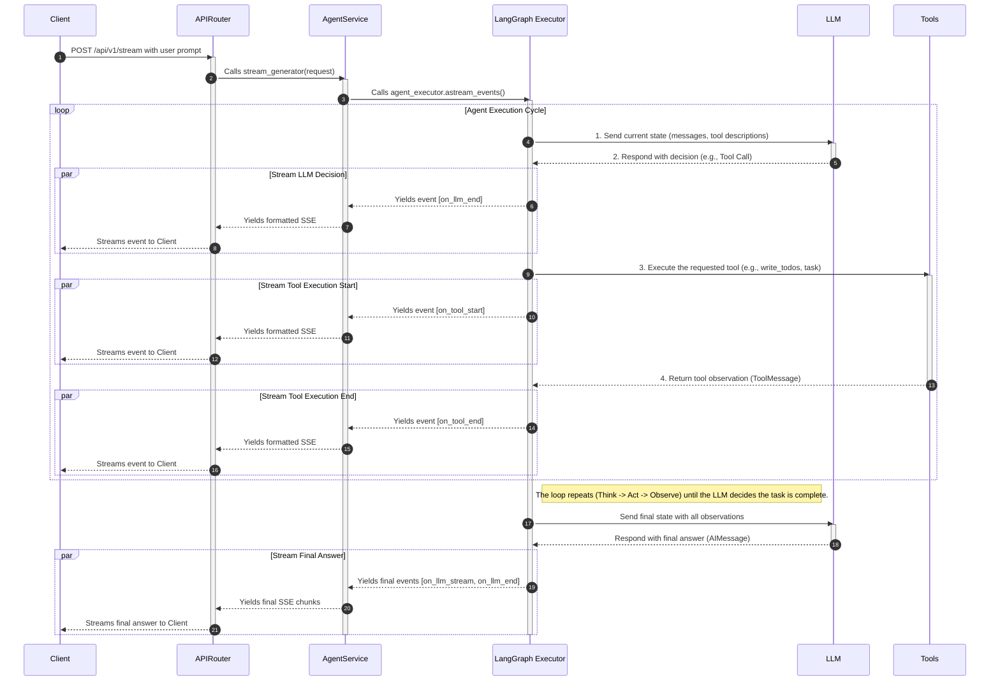
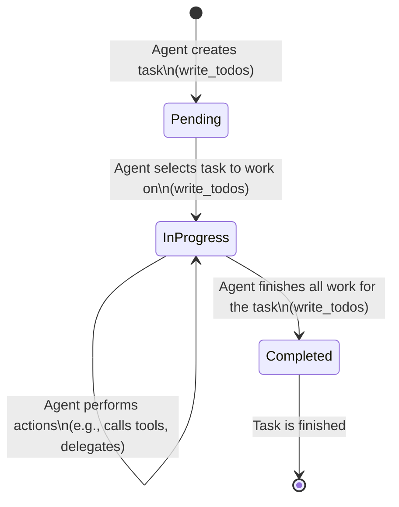
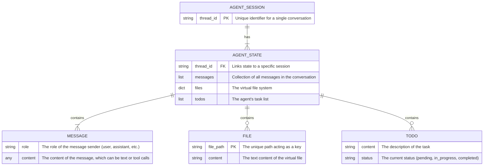
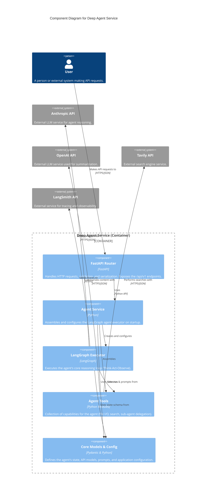

# Deep Agent Service

This project is a production-ready FastAPI service that deploys a research agent built with LangGraph. The agent leverages advanced techniques such as sub-agent delegation for context isolation and a virtual file system for context offloading.

## Features

- **Modular FastAPI Structure**: A clean, scalable, and modern `src` layout.
- **Containerized Environment**: Uses Docker and Docker Compose for reproducible and consistent development and production environments.
- **Advanced Agent Architecture**: Implements a "Deep Agent" using a supervisor/sub-agent pattern.
- **Stateful Operations**: Manages context through a virtual file system and a TODO list.
- **Asynchronous API**: Offers both synchronous (`/invoke`) and real-time streaming (`/stream`) endpoints.
- **Structured Logging**: Outputs logs in JSON format for easy parsing and analysis.
- **Type-Safe Configuration**: Uses Pydantic for robust, environment-aware configuration management.

## Prerequisites

- Docker and Docker Compose
- Python 3.11+
- Poetry

## Getting Started

Follow these steps to get the service running locally.

### 1. Clone the Repository

```bash
git clone https://github.com/zhu-weijie/deep-agent-service.git
cd deep-agent-service
```

### 2. Configure Environment Variables

The service requires API keys for its tools to function. Copy the example environment file and then edit it to add your keys.

```bash
# Create the .env file from the example
cp .env.example .env
```

Now, open the `.env` file and replace the placeholder values with your actual API keys:

**File:** `.env`
```# Environment variables for the Deep Agent Service
ENVIRONMENT=development

# --- API Keys ---
# Replace with your actual keys
TAVILY_API_KEY="your_tavily_api_key_here"
ANTHROPIC_API_KEY="your_anthropic_api_key_here"
OPENAI_API_KEY="your_openai_api_key_here"
LANGSMITH_API_KEY="your_langsmith_api_key_here"
```

### 3. Build and Run the Service

With Docker and Docker Compose, building and running the application is a single command:

```bash
docker compose up --build
```

The service will be available at `http://localhost:8000`.

## API Usage

The API documentation is automatically generated by FastAPI and is available at `http://localhost:8000/docs` when the service is running.

### Health Check

You can verify that the service is running by sending a request to the health check endpoint.

```bash
curl http://localhost:8000/health
```
Expected response:
```json
{"status":"ok","environment":"development"}
```

### Synchronous Invocation (`/invoke`)

This endpoint runs the agent to completion and returns the final state as a single JSON object.

**Example Request:**
```bash
curl -X POST http://localhost:8000/api/v1/invoke \
-H "Content-Type: application/json" \
-d '{
  "messages": [
    {
      "role": "user",
      "content": "Give me an overview of Model Context Protocol (MCP)."
    }
  ]
}'
```

### Streaming Events (`/stream`)

This endpoint streams events from the agent in real-time using Server-Sent Events (SSE). This is ideal for interactive, front-end applications.

**Example Request:**
```bash
curl -N -X POST http://localhost:8000/api/v1/stream \
-H "Content-Type: application/json" \
-d '{
  "messages": [
    {
      "role": "user",
      "content": "Give me an overview of Model Context Protocol (MCP)."
    }
  ]
}'
```
The `-N` flag disables buffering in curl, allowing you to see the events as they arrive.

## Diagrams

### Class Diagram



### Sequence Diagram



### State Diagram



### Entity Relationship Diagram



### C4 Component Diagram


