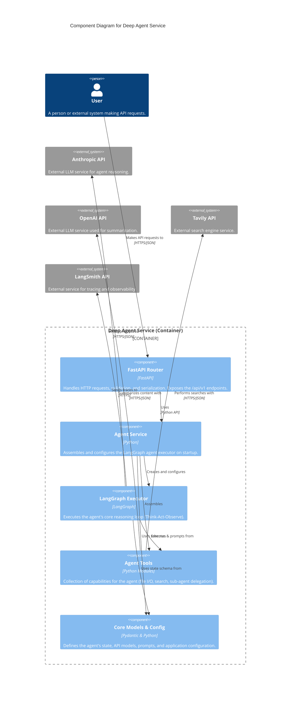

# C4 Component Diagram

```mermaid
C4Component
    title Component Diagram for Deep Agent Service

    %% --- Define People and External Systems First ---
    Person(user, "User", "A person or external system making API requests.")
    System_Ext(anthropic, "Anthropic API", "External LLM service for agent reasoning.")
    System_Ext(openai, "OpenAI API", "External LLM service used for summarization.")
    System_Ext(tavily, "Tavily API", "External search engine service.")
    System_Ext(langsmith, "LangSmith API", "External service for tracing and observability.")

    %% --- Group Components into the Container using a Boundary ---
    Container_Boundary(c1, "Deep Agent Service (Container)") {
        Component(api_router, "FastAPI Router", "FastAPI", "Handles HTTP requests, validation, and serialization. Exposes the /api/v1 endpoints.")
        Component(agent_service, "Agent Service", "Python", "Assembles and configures the LangGraph agent executor on startup.")
        Component(langgraph_executor, "LangGraph Executor", "LangGraph", "Executes the agent's core reasoning loop (Think-Act-Observe).")
        Component(agent_tools, "Agent Tools", "Python Modules", "Collection of capabilities for the agent (file I/O, search, sub-agent delegation).")
        Component(core_models, "Core Models & Config", "Pydantic & Python", "Defines the agent's state, API models, prompts, and application configuration.")
    }

    %% --- Define Relationships ---
    Rel(user, api_router, "Makes API requests to", "HTTPS/JSON")
    Rel(api_router, agent_service, "Uses", "Python API")
    Rel(agent_service, langgraph_executor, "Creates and configures")
    Rel(agent_service, agent_tools, "Assembles")
    Rel(agent_service, core_models, "Uses schemas & prompts from")
    Rel(langgraph_executor, agent_tools, "Executes")
    Rel(langgraph_executor, core_models, "Uses state schema from")
    Rel(langgraph_executor, anthropic, "Sends prompts to", "HTTPS/JSON")
    Rel(langgraph_executor, langsmith, "Sends traces to", "HTTPS")
    Rel(agent_tools, openai, "Summarizes content with", "HTTPS/JSON")
    Rel(agent_tools, tavily, "Performs searches with", "HTTPS/JSON")
```
