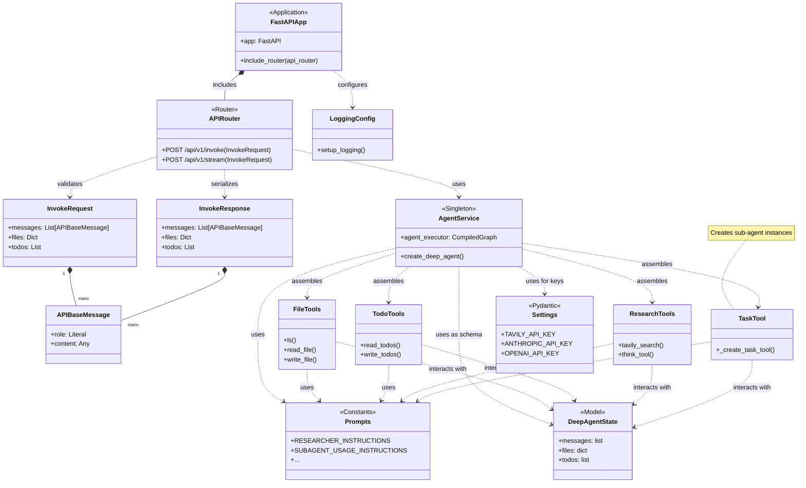

# Class Diagram

```mermaid
classDiagram
    direction TD

    %% 1. Define all classes first
    class FastAPIApp {
        <<Application>>
        +app: FastAPI
        +include_router(api_router)
    }
    class APIRouter {
        <<Router>>
        +POST /api/v1/invoke(InvokeRequest)
        +POST /api/v1/stream(InvokeRequest)
    }
    class InvokeRequest {
        +messages: List[APIBaseMessage]
        +files: Dict
        +todos: List
    }
    class InvokeResponse {
        +messages: List[APIBaseMessage]
        +files: Dict
        +todos: List
    }
    class APIBaseMessage {
        +role: Literal
        +content: Any
    }
    class AgentService {
        <<Singleton>>
        +agent_executor: CompiledGraph
        +create_deep_agent()
    }
    class DeepAgentState {
        <<Model>>
        +messages: list
        +files: dict
        +todos: list
    }
    class Prompts {
        <<Constants>>
        +RESEARCHER_INSTRUCTIONS
        +SUBAGENT_USAGE_INSTRUCTIONS
        +...
    }
    class FileTools {
        +ls()
        +read_file()
        +write_file()
    }
    class TodoTools {
        +read_todos()
        +write_todos()
    }
    class ResearchTools {
        +tavily_search()
        +think_tool()
    }
    class TaskTool {
        +_create_task_tool()
    }
    class Settings {
        <<Pydantic>>
        +TAVILY_API_KEY
        +ANTHROPIC_API_KEY
        +OPENAI_API_KEY
    }
    class LoggingConfig {
         +setup_logging()
    }

    %% 2. Define visual grouping with subgraphs
    subgraph `API Layer`
        APIRouter
        FastAPIApp
        subgraph `API Models`
            APIBaseMessage
            InvokeRequest
            InvokeResponse
        end
    end

    subgraph `Service Layer`
        AgentService
    end

    subgraph `Configuration`
        Settings
        LoggingConfig
    end
    
    subgraph `Agent Tools`
        FileTools
        TodoTools
        ResearchTools
        TaskTool
    end

    subgraph `Core Logic & Models`
        DeepAgentState
        Prompts
    end
    
    %% 3. Define relationships between classes
    FastAPIApp *-- APIRouter : includes
    FastAPIApp ..> LoggingConfig : configures
    
    APIRouter ..> AgentService : uses
    APIRouter ..> InvokeRequest : validates
    APIRouter ..> InvokeResponse : serializes
    InvokeRequest "1" *-- "many" APIBaseMessage
    InvokeResponse "1" *-- "many" APIBaseMessage

    AgentService ..> Settings : uses for keys
    AgentService ..> Prompts : uses
    AgentService ..> DeepAgentState : uses as schema
    AgentService ..> FileTools : assembles
    AgentService ..> TodoTools : assembles
    AgentService ..> ResearchTools : assembles
    AgentService ..> TaskTool : assembles

    FileTools ..> DeepAgentState : interacts with
    TodoTools ..> DeepAgentState : interacts with
    ResearchTools ..> DeepAgentState : interacts with
    TaskTool ..> DeepAgentState : interacts with
    
    FileTools ..> Prompts : uses
    TodoTools ..> Prompts : uses
    ResearchTools ..> Prompts : uses
    TaskTool ..> Prompts : uses

    note for TaskTool "Creates sub-agent instances"
```
