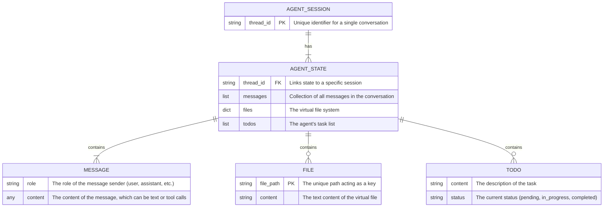

# Entity Relationship Diagram

```mermaid
erDiagram
    AGENT_SESSION {
        string thread_id PK "Unique identifier for a single conversation"
    }

    AGENT_STATE {
        string thread_id FK "Links state to a specific session"
        list messages "Collection of all messages in the conversation"
        dict files "The virtual file system"
        list todos "The agent's task list"
    }

    MESSAGE {
        string role "The role of the message sender (user, assistant, etc.)"
        any content "The content of the message, which can be text or tool calls"
    }

    FILE {
        string file_path PK "The unique path acting as a key"
        string content "The text content of the virtual file"
    }

    TODO {
        string content "The description of the task"
        string status "The current status (pending, in_progress, completed)"
    }

    %% --- Relationships ---
    AGENT_SESSION ||--|{ AGENT_STATE : "has"
    AGENT_STATE ||--|{ MESSAGE : "contains"
    AGENT_STATE ||--o{ FILE : "contains"
    AGENT_STATE ||--o{ TODO : "contains"
```
