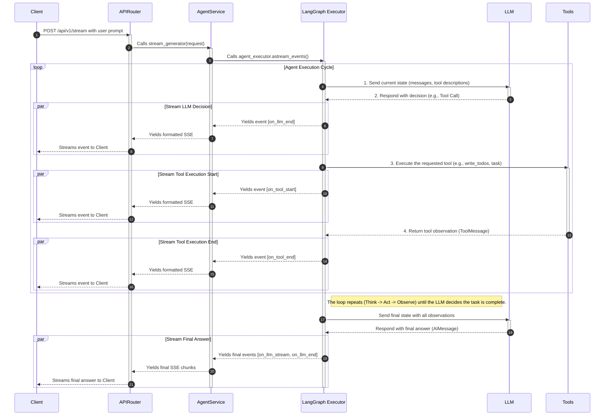

# Sequence Diagram

```mermaid
sequenceDiagram
    autonumber

    participant C as Client
    participant R as APIRouter
    participant S as AgentService
    participant G as LangGraph Executor
    participant L as LLM
    participant T as Tools

    C->>R: POST /api/v1/stream with user prompt
    activate R

    R->>S: Calls stream_generator(request)
    activate S

    S->>G: Calls agent_executor.astream_events()
    activate G

    loop Agent Execution Cycle
        G->>L: 1. Send current state (messages, tool descriptions)
        activate L
        L-->>G: 2. Respond with decision (e.g., Tool Call)
        deactivate L
        
        par Stream LLM Decision
            G-->>S: Yields event [on_llm_end]
            S-->>R: Yields formatted SSE
            R-->>C: Streams event to Client
        end

        G->>T: 3. Execute the requested tool (e.g., write_todos, task)
        activate T
        
        par Stream Tool Execution Start
            G-->>S: Yields event [on_tool_start]
            S-->>R: Yields formatted SSE
            R-->>C: Streams event to Client
        end
        
        T-->>G: 4. Return tool observation (ToolMessage)
        deactivate T

        par Stream Tool Execution End
            G-->>S: Yields event [on_tool_end]
            S-->>R: Yields formatted SSE
            R-->>C: Streams event to Client
        end
    end
    
    note right of G: The loop repeats (Think -> Act -> Observe) until the LLM decides the task is complete.

    G->>L: Send final state with all observations
    activate L
    L-->>G: Respond with final answer (AIMessage)
    deactivate L
    
    par Stream Final Answer
        G-->>S: Yields final events [on_llm_stream, on_llm_end]
        S-->>R: Yields final SSE chunks
        R-->>C: Streams final answer to Client
    end
    
    deactivate G
    deactivate S
    deactivate R
```
