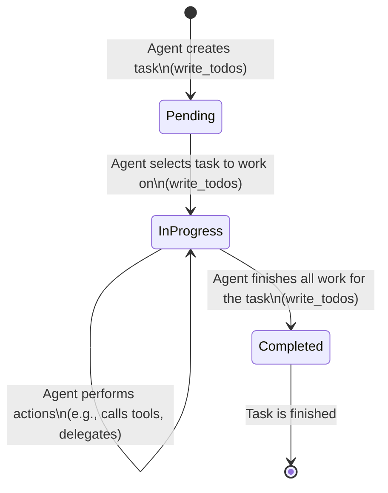

# State Diagram for Supervisor Agent

```mermaid
stateDiagram-v2
    direction TB

    [*] --> Pending: Agent creates task\n(write_todos)

    Pending --> InProgress: Agent selects task to work on\n(write_todos)
    InProgress --> InProgress: Agent performs actions\n(e.g., calls tools, delegates)
    InProgress --> Completed: Agent finishes all work for the task\n(write_todos)

    Completed --> [*]: Task is finished
```
